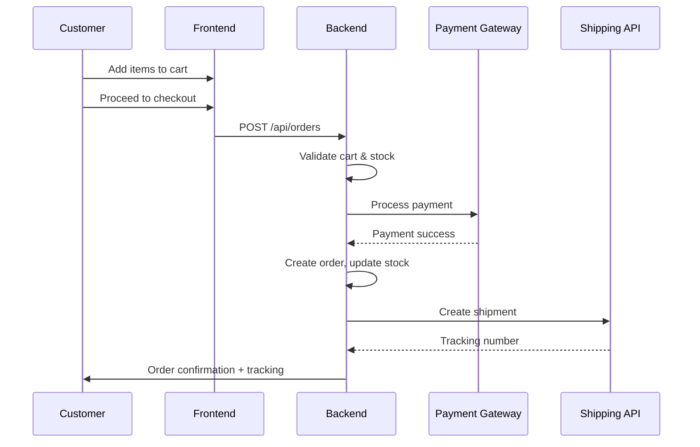

# Software Design Description (SDD)  
## Online Pet Accessories Platform  

---

## 1. INTRODUCTION  

**Purpose**  
This document describes the software design for the Online Pet Accessories Platform. It provides developers, testers, and system administrators with a blueprint for implementing, verifying, and maintaining the system.  

**Scope**  
The platform supports browsing and purchasing pet accessories online. Features include product catalog, shopping cart, order processing, payment, notifications, and customer support. It is a responsive web application available on desktop and mobile browsers.  

**Audience**  
- Software architects and developers  
- QA and testers  
- DevOps engineers  
- Security reviewers  
- Business stakeholders  

**References**  
- IEEE 1016-2009 (SDD)  
- ISO/IEC/IEEE 29148 (requirements)  
- ISO/IEC/IEEE 29119 (testing)  
- GDPR  
- PCI DSS  

---

## 2. SYSTEM OVERVIEW  

The system is a modular, service-oriented e-commerce platform.  
- Customers: browse products, manage accounts, purchase items, track orders.  
- Admins: manage catalog, monitor sales, configure system.  
- Logistics staff: process and ship orders.  
- External systems: payment providers, shipping carriers, email/SMS notifications.  

---

## 3. ARCHITECTURAL VIEWS  

### 3.1 Context View  

**Actors & interactions**  
- **Customers ↔ Platform**: registration, login, browse catalog, add to cart, checkout, order tracking.  
- **Admins ↔ Platform**: manage products, users, promotions, reporting.  
- **Logistics ↔ Platform**: access orders, update fulfillment status.  
- **Platform ↔ Payment APIs**: process transactions.  
- **Platform ↔ Shipping APIs**: generate labels, track shipments.  
- **Platform ↔ Notification APIs**: send order confirmations and updates.  

```mermaid
flowchart LR
    Customer -->|Browse, Buy| WebApp
    Admin -->|Manage Products| WebApp
    Logistics -->|Fulfillment Updates| WebApp
    WebApp --> PaymentAPI
    WebApp --> ShippingAPI
    WebApp --> NotificationAPI
````

### 3.2 Component View

**Logical components**

* **AuthService**: registration, authentication, JWT/session management.
* **CatalogService**: products, categories, search.
* **CartService**: shopping cart persistence and updates.
* **OrderService**: checkout, invoice generation, status updates.
* **PaymentService**: payment gateway integrations.
* **InventoryService**: stock management and alerts.
* **NotificationService**: email/SMS for order confirmations and promotions.
* **SupportService**: ticket management and chat integration.
* **ReportingService**: dashboards, analytics.
* **Database**: relational DB for all entities.

```plantuml
@startuml
package "E-commerce Platform" {
  [AuthService]
  [CatalogService]
  [CartService]
  [OrderService]
  [PaymentService]
  [InventoryService]
  [NotificationService]
  [SupportService]
  [ReportingService]
  [Database]
}

[AuthService] --> [Database]
[CatalogService] --> [Database]
[CartService] --> [Database]
[OrderService] --> [Database]
[PaymentService] --> [OrderService]
[InventoryService] --> [OrderService]
[NotificationService] --> [OrderService]
[ReportingService] --> [Database]
@enduml
```

### 3.3 Deployment View

* **Frontend**: React SPA served via CDN, HTTPS enforced, responsive design.
* **Backend**: Node.js/Express microservices running in Docker containers, behind a load balancer.
* **Data Layer**: PostgreSQL (with read replicas), Redis for caching sessions and hot data.
* **Integrations**: Stripe/PayPal (payments), DHL/FedEx (shipping), SendGrid/Twilio (notifications).
* **Ops**: CI/CD pipelines, blue-green deployments, centralized logging (ELK), monitoring (Prometheus).

---

## 4. DATA DESIGN

**Core entities**

* Customer(id, name, email, passwordHash, addresses, createdAt)
* Product(id, name, description, price, category, stock)
* Cart(id, customerId, items)
* CartItem(id, cartId, productId, quantity)
* Order(id, customerId, total, status, createdAt)
* OrderItem(id, orderId, productId, quantity, price)
* Payment(id, orderId, method, status, amount)
* Shipment(id, orderId, trackingNumber, status, carrier)
* SupportTicket(id, customerId, subject, status, messages)

**Integrity rules**

* Stock must be reduced only after successful payment.
* Order must contain at least one item.
* Payments reference exactly one order.
* Deleting a product is restricted if referenced by an active order.

---

## 5. INTERFACE DESIGN

**REST API endpoints (examples)**

* **Authentication**

  * `POST /api/auth/register` → create account
  * `POST /api/auth/login` → return JWT

* **Catalog**

  * `GET /api/products?search={query}&category={id}`
  * `GET /api/products/{id}`

* **Cart**

  * `POST /api/cart` → add item
  * `DELETE /api/cart/{itemId}` → remove item

* **Orders**

  * `POST /api/orders` → place new order
  * `GET /api/orders/{id}` → get order details
  * `GET /api/orders/{id}/status` → check order status

* **Payments**

  * `POST /api/payments` → process payment

* **Support**

  * `POST /api/support/tickets` → open ticket
  * `GET /api/support/tickets/{id}` → get ticket status

---

## 6. DETAILED DESIGN

### 6.1 Component Responsibilities

* **OrderService**

  * Validates cart, stock, and payment.
  * Creates order transactionally.
  * Emits `OrderPlaced` event.

* **PaymentService**

  * Integrates with Stripe/PayPal.
  * Handles callbacks for success/failure.
  * Updates order payment status.

* **NotificationService**

  * Sends order confirmation, shipping updates.
  * Retries failed notifications.

* **InventoryService**

  * Updates stock after order confirmation.
  * Sends alerts for low inventory.

### 6.2 Sequence – “Place Order”



### 6.3 Error Handling & Recovery

* Validation errors → HTTP 400.
* Payment failures → rollback transaction.
* Global error handler with correlation IDs.
* Retry queues for failed notifications.

---

## 7. SECURITY & COMPLIANCE

* OAuth2/JWT authentication.
* Passwords hashed with Argon2.
* Role-based access (Customer, Admin, Support).
* HTTPS enforced everywhere.
* GDPR compliance (right to access/delete data).
* PCI DSS compliance for payments.
* Audit logging of all sensitive actions.

---

## 8. PERFORMANCE, SCALABILITY, AVAILABILITY

* API stateless, horizontally scalable.
* Caching with Redis for product catalog and sessions.
* DB read replicas for scale-out.
* Autoscaling policies triggered by CPU/RPS thresholds.
* SLA: 99.9% uptime, p95 latency < 300ms.

---

## 9. OBSERVABILITY

* Structured JSON logs with correlation IDs.
* Metrics: RPS, latency, error rates, stock levels.
* Distributed tracing with OpenTelemetry.
* Alerts on SLO breaches, failed payments, or delivery delays.

---

## 10. INTERNATIONALIZATION & ACCESSIBILITY

* i18n with message bundles (EN/FR at launch).
* WCAG 2.1 AA compliance.
* Support for screen readers, ARIA roles, keyboard navigation.

---

## 11. DESIGN RATIONALE

* **React + Node.js**: rapid development, shared ecosystem.
* **PostgreSQL**: strong consistency, relational constraints for orders/payments.
* **Microservices**: independent scaling of hot spots (orders, payments).
* **Event-driven**: ensures resilient notifications and reporting.

---

## 12. ASSUMPTIONS & CONSTRAINTS

* Initial release: web platform only, no native mobile app.
* Third-party shipping and payment APIs are reliable.
* Limited budget excludes advanced recommendation engine in v1.

---

## 13. OPEN ISSUES / FUTURE WORK

* Real-time inventory reservation during checkout.
* Loyalty program and personalized recommendations.
* Advanced analytics (customer segmentation, predictive sales).
* Integration with additional payment providers.

